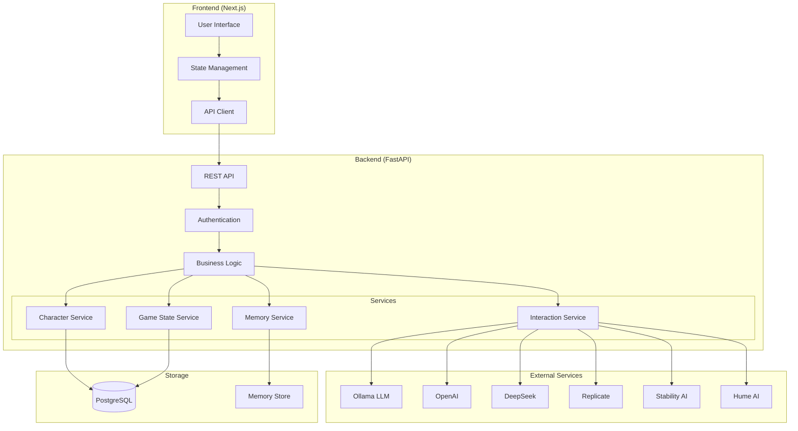
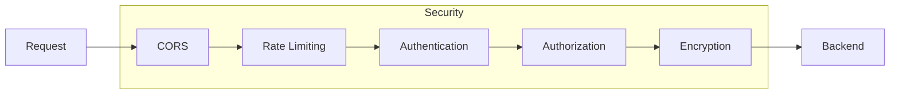
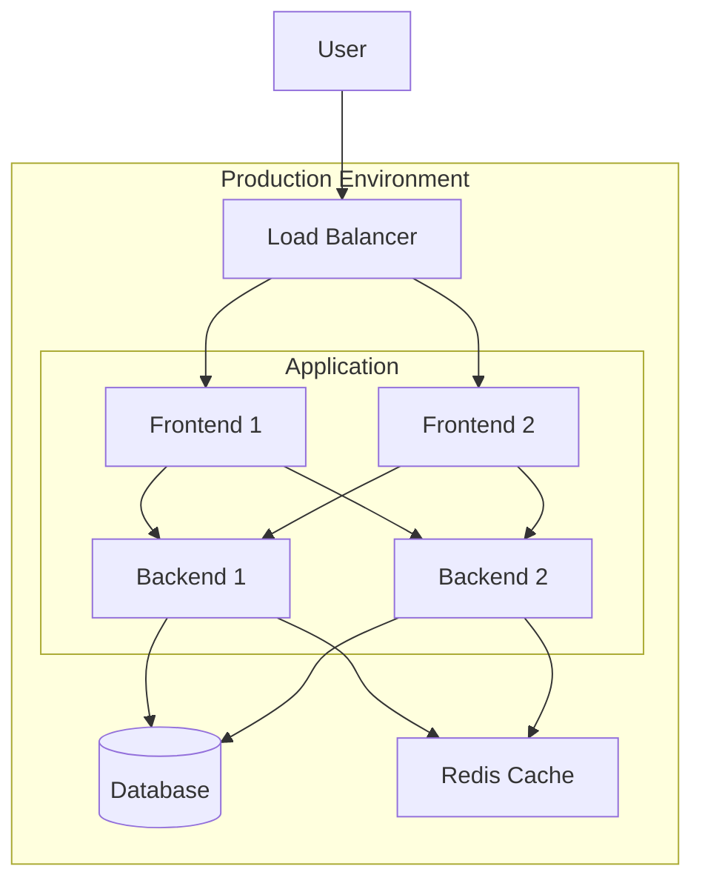
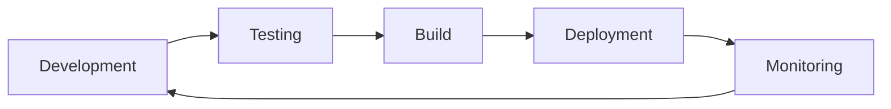

# Unbounded Architecture

## System Overview

## Component Details

### Frontend
- **User Interface**: React components and pages
- **State Management**: Zustand for global state
- **API Client**: Axios for API communication

### Backend
- **REST API**: FastAPI endpoints and routers
- **Authentication**: JWT-based auth with bearer tokens
- **Business Logic**: Core application logic
- **Services**:
  - Character Service: Character management
  - Memory Service: Memory persistence using mem0
  - Interaction Service: Character interactions and responses
  - Game State Service: Character state management

### External Services
- **Ollama**: Local LLM for character interactions
- **OpenAI**: Embeddings and backup LLM
- **DeepSeek**: Alternative LLM provider
- **Replicate**: Additional AI models
- **Stability AI**: Image generation
- **Hume AI**: Emotion analysis

### Storage
- **PostgreSQL**: Main database for users, characters, and states
- **Memory Store**: Specialized storage for character memories

## Data Flow

1. User interacts with UI
2. Frontend sends API request
3. Backend authenticates request
4. Business logic processes request
5. Services interact with storage and external services
6. Response flows back to UI

## Security Layers

## Deployment Architecture

## Development Workflow

